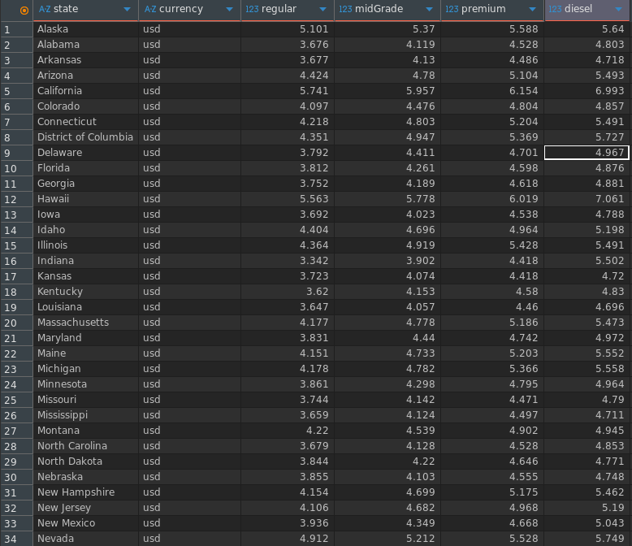

# Gas Prices ETL
## Contents
1. [Project Overview](#project-overview)
2. [Tech Stack](#tech-stack)
3. [Prerequisites](#prerequisites)
4. [Project Structure](#project-structure)
5. [Environment Setup](#environment-setup)
6. [Project Architecture](#project-architecture)
7. [Running the pipeline](#running-the-pipeline)

## Project Overview
This project provides an ETL pipeline that extracts gas prices from all USA states from the [Collect REST API](https://collectapi.com/api/gasPrice/gas-prices-api), transforms the data into a logical structure, and loads the cleaned data to a postgres database.
## Tech Stack
- Python
- SQLalchemy
- psycopg2
- PostgreSQL
- Pandas
- Collect API

## Project Structure
```text
gas_prices_etl
├── README.md           #project documentation
├── config.py           #project environment settings
├── etl
│   ├── __init__.py     #package initialization
│   ├── extract.py      #data ingestion logic
│   ├── load.py         #database upload logic
│   └── transform.py    #data transformation logic
├── main.py             #ETL synchronization
└── requirements.txt    #project dependencies list
```
## Prerequisites
1. A running postgres database
2. [A Collect API key](https://collectapi.com/api/gasPrice/gas-prices-api)

## Environment Setup
1. **python virtual environment**

First create and activate a python virtual environment which will manage the dependencies in the project
```bash
# create the virtual environment
$ python -m venv <your_venv_name>
#activate the virtual environment
$ source <your_venv_name>/bin/activate
```
2. **Cloning**

Clone the project into you virtual environment and switch to the repository root folder.
```bash
$ git clone <github repository>
$ cd gas_prices_etl
```
3. **Configuration**

Create a .env folder and copy paste the details in [.env.example](.env.example). Ensure to replace the required configuration values with you own values.
```bash
$ touch .env
```
4. **Dependencies syncronization**

To install all the depencies that are in the [requirements.txt](requirement.txt) file, inside the project root folder, run the command below:
```bash
$ ~/gas_prices_etl$ pip install -r requirements.txt
```

## Project Structure
There are 3 main components in this project
1. extract
2. transform
3. load

### Extract
This is where the data is gotten from collect API and made available for the ETL. This module incorporates the python `requests` module to query the REST API.
### Transform
After ingesting the data in the extract module, the data is transformed into a clear structure that can be stored inside the database. This transformation is carried out using python `pandas` module.
### Load
After cleaning and transforming the data into the required structure, it's now ready to be stored in the database. This is done by using `sqlalchemy` and the `psycopg2 driver` to connect to the database, and pandas `to_sql` function to upload the data.

**General Architecture**
```text
 -----------
|Collect API|
 -----------
    ⬇
Extract
    ⬇
Transform
    ⬇
   Load
    ⬇
 --------    
|Database|
 --------
```
 ## Running the Pipeline
 Inside the [main.py](main.py) file, the steps of the ETL process have been synchronized sequentially, and it serves as the pipeline's entrypoint. For the pipeline to run, we only need to run this file. Inside the projects root folder, run the command below and the entire the pipeline will be up and running:
 ```bash
 $ python -m main
 ```

<figcaption align='center'><i>US gas prices table</i></figcaption>